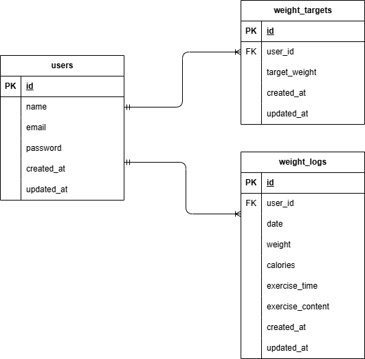

# Pigly(体重管理アプリ)

## 環境構築

**Docker ビルド**

1. `git clone git@github.com:sayouta1224/Pigly.git`
2. DockerDesktop アプリを立ち上げる
3. `docker-compose up -d --build`

> *Mac の M1・M2 チップの PC の場合、`no matching manifest for linux/arm64/v8 in the manifest list entries`のメッセージが表示されビルドができないことがあります。
エラーが発生する場合は、docker-compose.yml ファイルの「mysql」内に「platform」の項目を追加で記載してください*

```bash
mysql:
    platform: linux/x86_64(この文追加)
    image: mysql:8.0.26
    environment:
```

> *windows の PC の場合、エラーが発生する場合は、`sudo chmod -R 777 *`のコマンドを実行しもう一度コマンドを実行しなおしてください*

**Laravel 環境構築**

1. `docker-compose exec php bash`
2. `composer install`
3. 「.env.example」ファイルを 「.env」ファイルに命名を変更。または、新しく.env ファイルを作成
4. .env に以下の環境変数を追加

```text
DB_CONNECTION=mysql
DB_HOST=mysql
DB_PORT=3306
DB_DATABASE=laravel_db
DB_USERNAME=laravel_user
DB_PASSWORD=laravel_pass
```

5. アプリケーションキーの作成

```bash
php artisan key:generate
```

6. マイグレーションの実行

```bash
php artisan migrate
```

7. シーディングの実行

```bash
php artisan db:seed
```

## テストユーザーのログイン情報

- （お名前　　　：山田 太郎）
- メールアドレス：test@example.com
- パスワード　　：coachtech1106

> *初めに`http://localhost/register/step1`や`http://localhost/login`にアクセスした際、` The stream or file "/var/www/storage/logs/laravel.log" could not be opened in append mode: Failed to open stream: Permission denied The exception occurred while attempting to log:`のメッセージが表示され画面表示ができないことがあります。
エラーが発生する場合は、以下のコマンドを実行して、再度アクセスしてください*

```bash
docker compose exec php bash
chmod -R 777 storage bootstrap/cache
php artisan config:clear
php artisan route:clear
php artisan cache:clear
```

## 使用技術(実行環境)

- PHP 8.1
- Laravel 8.83.8
- MySQL 8.0.26

## ER 図



## URL

- 開発環境：http://localhost/
- phpMyAdmin：http://localhost:8080/
